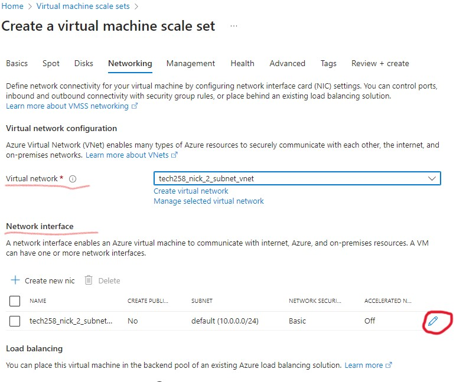

# Auto scaling

### What is high availability and scalability

* *High availability:* is the ability to have our instances hosting our app available to users with little to no downtime (as  much as possible).

* *Scalability:* is the ability to produce more or less instances as is necessary. 

### High availability and scalability using Azure virtual machine scale set


*How is this achieved?* By using a vm scale set we are able to set up multiple virtual machines by default (known as "initial") and never have less than the initial set. This means that our app is always available as it is launched with multiple vms. 

* So, in case one goes down there is another available. And in response to a policy set e.g CPU Load we can add an extra vm. The scale set will take an average of CPU load of all healthy vms in use and if above the set threshold it will scale up (add a vm).

This makes scalability possible as we can increase or decrease vms as necessary. And  is  possible as we always have a machine with our app deployed.

If we host our vm with app in one availability zone, if it goes down so does our app. Even if we deploy multiples vms, if they are in the same Availability Zone, they will all go down.

By having our vms in multiple availability zones, if an occurance was to happen that brings it down (e.g. power cut, fire, natural disaster), we have vms in other availability zones which are unaffected. This means our app is available even if unforseen circumstances occur we have a layer of protection.

(Can use custom image to create vm or use vm to create a custom image

We have options for our starting image

Virtual Machine scale set)

We set a policy (custom auto scale), when will it scale? parameters, average cpu load, minimum vms (2), max vms
* * minimum set to 2 so we have a back up in case one goes down, app always available. vms in same subnet but different Availablty zones. We are setting up high availabilty and scalability

vm scale set is responsible for creating virtual machines

need a load balancer (internet facing) directs traffic from outside to a vm dependent on policy set

Load balancer has front end IP (traffic is sent there not directly to vms so load balancer can do its job)

### Setting up a scale set

* #### Preparation of scale set

Before starting a scale set it is vital to test and make sure the User Data and AMI work, as that is what the scale set will be using to create the virtual machines. So make sure you have full confidence in you User Data, make sure they are both thoroughly test.

* * Keep in mind the Azure portal regularly changes so some tabs may move, some features may be named differently.

#### Creating the scale set

Now we are fully confident in our User Data and AMI we can begin creating the scale set. 

* First we search for the scale set creation, and choose Virtual machine scale sets.


* Next we click create after being taken to the virtual machine scale set page.


* Then we go through our basic settings. We want to make sure to select all Availability zones.


* Next is Orchestration. We set it to uniform, this means all created vms will be identical in size and specifications. Security type is standard.
* We then choose autoscaling, which scales out vms automatically based on a given CPU metric. We then configure scaling to set our parameters for scaling.


* We are taken to the scaling configuration page where we click the pencil on the right, so we can edit our scaling conditions.


* The condition name can remain the same. *Scale mode* is set to *auto*, so the scale can be automated. 
* * *Initial instance count* is set to 2, so on launch 2 instances are made.
* * *Instance limit minimum* is set to 2, so we will never have less than 2 instances at a given time.
* * *Instance limit maximum* is set to 3, so we will not have more than 3 instances if autoscaling needs to occur.
*  * *Scale out* is set to 75%, so when the average CPU threshold across all healthy instances is over the set amount, a vm will be launched.


* Next we set how many instances will be added when the threshold is reached. Which is 1. *Scale in* is set, so when average CPU threshold falls below a set number an instance is removed. *(Remember we will never have less than 2 as that is our minimum)*. We then choose how many instances to remove and how often our instances are checked, which is set to 10.


* Once complete, save or re-edit if necessary.


* We the make sure to choose our working and tested AMI. Select the correct size, set the right username and ssh key.


* Next we move on to select a standard disk (as we are just testing).


* We move on to network where we choose our virtual network, and use the pencil icon to set our NIC (Network Interface Card. Which allows us to access the internet).



* This takes us to the NIC editing page where NIC is named (we can leave as is), our subnet is chosen (as it is our app being launched we use our public subnet), and we create or choose an existing security group. 
* * Make sure it ts the correct group if you chose an existing one. The rest is left as is.


* We then create our load balancer. Which redirects internet traffic to instances based on their health. 


* The panel opens on the right, and we can configure our load balancer, giving a clear name, type *(public as we want internet traffic going to the load balancer to be distributed among our vms)*, protocol *TCP which is the internet*, and we can set some rules further on


* We then set the ports for the load balancer. 80 is the internet, so it can receive traffic. Inbound NAT is where it sends traffic which are our instances. *Port range start* is our instances, 22 is the ssh. The ports are usually set this way by default, and we now click create.


* The health tab is next. We set our instance health to be monitored by selecting the enable box. The default configuration is fine, but we can check if we wish.
* We enable the automatic repair policy and set the grace period in minutes. Here it is 10, which means an unhealthy instance is given 10 mins to become healthy, or it is replaced with a new healthy instance.


* User data is after. We paste our tested and working minimal script (the same used for our AMI) so our app is run. Do not alter it if it works, though there are some redundant steps they do not do hurt anything, whereas altering a working script can.


* Finally, we tag our resource, review and then create. We must give our resources some time to deploy.


* Then once deployed we can go to our resource.


### Instance health

While in our scale set resource we can see our instances and their health. They start as unhealthy when newly created, but give them some time and refresh and they should be ready


* * #### Accessing the app
* Because we route outside traffic via the load balancer, if we want to see our app, we must use the public IP of our Load balancer. Our instances are giving private IPs, so they cannot be accessed from outside our network.


* This also means to ssh in we have to use the public IP of our load balancer, and specify the port (instance) we want to go to using our ssh private key. We use the same command as usual but add ```-p``` and the port number: 
```ssh -i ~/.ssh/tech258_nick_az_key -p 50000 adminuser@4.158.78.3```
* * under the computer name column when in the scale set overview, the long number is our instance port number.

### Instance health continued...

By clicking on th box next to an instance, we are given some options on what to do with that instance. We particularly are interested in:
* ```stop``` to stop the instance.
* ```start``` to start the instance.
* ```re-image``` to set the instance to its original state.
* ```upgrade``` to set the instances with any modifications we made to the user data.


### Unhealthy instances

To test the load balancer we can create an unhealthy instance by stopping and starting it.

As user data is one run once, and doesn't re-run, the instance becomes unhealthy as the app is down. We get a 502 bad gateway while the load balancer adjusts & redirects traffic to the healthy instance.

As we set the grace period to 10 minutes, the load balancer gives the instance that time to become healthy before deleting it and creating a new instance.


### Clean up

To avoid unnecessary charges we must clean up our scale set and all it's attached resources. We can open up each resource (scale set, load balancer, public IP) into separate browser tabs to make the process easier to follow.

* First is the scale set. We can use the panel on the left to reach the load balancer as highlighted.


* Second is the load balancer, as it is using the public IP, we must delete it first. As an IP in use cannot be deleted. We press the highlighted link to get to it, 
* * and the front end IP link on the right to get to the public IP.


 
* Last is the public IP, accessed via the load balancer overview.


* Then we can delete it.


