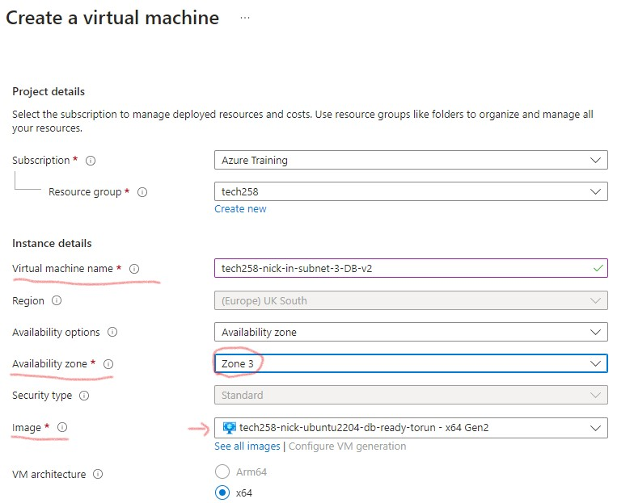
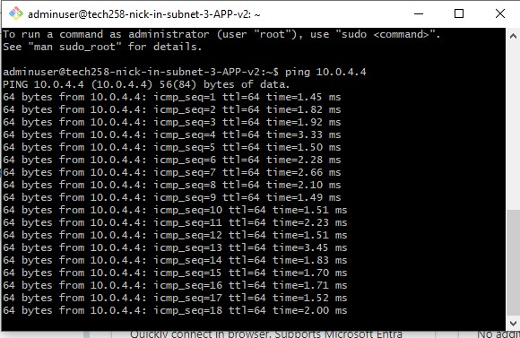
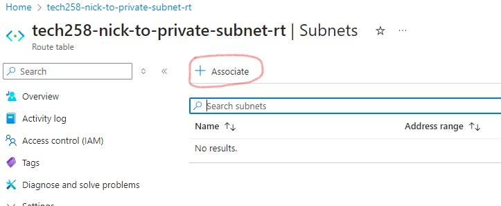

# Securing database with Azure


### Making database truly private

Hosting our database on an instance in our private subnet does not make it secure. Even though we have network security groups (nsg) specifying the allowed ports, it still has a public IP and can be accessed (We don't want a way for our database to be accessed from the outside).

Furthermore, without any extra configurations, the communication inside our virtual network is too free and undirected. This means traffic is able to go to subnets or apps we may not want them to. 

There is also no filter to tell which traffic is safe or not.

To make the subnet truly private, and secure our database there are a few things to put in place. Stricter nsg rules, to only allow traffic from ssh and mongodb (database), and ignore everything else. 

We also need a way to filter traffic, and direct the safe traffic where it needs to go and reject the rest. Then finally, we need to remove the databases public IP, so it is inaccessible from outside our virtual network.

Having multiple layers of security like this is important as we don't want a *single point of failure*. Meaning if one measure goes down our whole architecture is no longer secure. Think of it like having multiple locks on your door, or a gate.

### DMZ subnet

To add some extra layers of security we create a Demilitarised zone subnet (DMZ), and set up a Network Virtual Appliance (NVA) virtual machine (VM) inside. The NVA acts as filter/firewall and only allows traffic thorough if it meets the rules we set.

In essence our NVA is held here.

* #### NVA (Network Virtual Appliance)

The NVA like other virtual instances has a Network Security Group (NSG) and a Network Interface Card (NIC). We can ssh into the NVA Virtual Machine (VM) to configure it.

The NVA makes sure only traffic from right source talks to e.g. the database subnet. It forwards the filtered traffic, making it follow a certain route, ensuring only the right database traffic gets through. (This is how it acts as a filter/firewall)  

Currently, any device in our virtual network can talk to each other (system route) via any path. While a user route says communication can only can go this way. Directing it to its next destination.

Using an NVA should not cause any delay in accessing the app database page

### Routing and Route tables

A *route* is a path traffic is allowed to take. Think of it like train tracks. The movement is restricted, and it can only reach the destination set.

A *route table*  enforces the path/route traffic has to make. This can make sure, for example, the next place (next hop) traffic goes is the NVA, so it can be filtered, and sure its meant for the right destination.

* nsg rules have priority . The higher the number the lower the priority. The lowest priority is given the highest number.

### Redundancy & Recovery

As you will soon see, we will be putting our virtual machines 3 separate Availability Zones. This is so if one AZ goes down, we still have portions of our architecture available and can recover easier, instead of starting from scratch.

Having multiple similar vms in different AZs is a form of redundancy. Another is having a disaster recovery plan. Having one allows us to get our applications back online quicker should something happen, as we have steps set in place to follow.

We can also create back up plans, which are useful when using NVAs (Network Virtual Appliance). As they are a layer of security we should include some fault tolerance. For example:
* * We can create multiple NVAs
* * Even better, we can automate this by creating a scale set and use auto-scaling to have as many NVA vms we'd like and route the traffic through a load balancer, so it will manage the traffic going to the NVAs. 

This is an example of making each part of our architecture resilient. There are various ways to tackle an issue and automate it, be creative.


## Creating a Virtual Private Cloud (VPC)

### Step 1: *Create a virtual network*

* Search for Virtual Network and click.


* Press create


* Follow good naming conventions, so you can track the resource easier. As the Virtual Network will have 3 subnets we state it in the name.
* Make sure you are in the correct region also


* We move on to IP addresses and create the desired subnets (a public, a DMZ, and a private), by pressing add a subnet. 


* Create the public subnet, name it, give it an IP starting address (10.0.2.0).


* Next we add the DMZ subnet.


* Then the private subnet. Pay special attention to clicking enable private subnet. This means vms in here it cannot access with the internet, making it private. 


* This is important as it also means the vms in this subnet cannot access the internet to install mongodb, hence why making an image with the mongodb database already installed was important.


* We tag our resource, review it and then create.


### Step 2: *Create Database Virtual machine*

We always create the database vm first. We can create the database virtual machine by looking for our created database image.

* Search for images and click


* Find the link to your image and click


* Press create vm


* Complete the basic configurations, paying attention to naming conventions and hosting in Availability zone 3. 
* Note the image is preselected. And region and security type are fixed.



* The disk is set to standard

* Pay attention to pick the right virtual network, subnet (private) and set public IP to none (meaning our database cannot be accessed from outside the VPC). Choose the correct network security group or create a new one.


* We then tag our resource, review and create.

### Step 3: Create App Virtual Machine

Next we create the app instance (vm). This is so we can test our database and app are working together as intended.

Keep in mind we need to alter our DB-HOST environment variable in our user data script to match the new private IP of the database.

* Like earlier we use images to create our vm, this time making sure we use created app image.


* As always follow naming convention, and we host this vm in Availability Zone 1. Again the image is pre-selected.


* We create our machine following the usual steps.
* * We may however create a more secure network security group. 
* * Also make sure to adapt the user data (under Advanced tab) to the new Private IP of the database.

### Step 4: *Create Virtual Network Appliance VM*

* We now create our VNA instance. We do not have an image for it, so we use the ubuntu 22.04 image. We place it in Availability Zone 2. Again follow naming conventions.


* Make sure the correct virtual network is selected, and the DMZ subnet also. We create or use an existing network security group allowing the SSH and HTTP ports.


### Step 5: *Check app and database can communicate*

As we are in a VPC, Azure by default sets the network security group to allow all internal network traffic unless we restrict it. AWS restricts internal traffic by default

To check packets (network traffic) can be sent between our app and database we ssh into our app instance and use the ```ping``` command and specify the destination the database private IP ```ping 10.0.4.4```. 


Packets will continually be sent to the database.



We can also check by using the apps public IP.

### Step 6: *Set up User Router*

User router restricts the path traffic is allowed to take inside the VPC. We set this route by creating a route table.

* Start by searching route tables and click


* Then click create


* Check the region is correct. Name the route table correctly, by route, then rt at the end to make visible it is a route table.


* Tag the resource, review and then create.

* Next we go to the resource


* Then on the left panel we go to settings and then routes, so we can set the routes.


* We click add


* We configure the route by specifying the route name, destination type which is IP addresses, the destination IP which is our private subnet (as traffic will be trying to reach our database inside the private subnet).


* We then specify next hope type which is Virtual Appliance. Next hop address is the private IP of our VA instance as traffic must first flow through it to be filtered before going to the database (which is what we want).


* We can then see the added route


* We must then associate the route table with a subnet. In this case our public subnet as outside internet traffic flows through it. 
* It is important that the source of traffic (in this case the public subnet) is associated to a route table. This is so the incoming traffic is guided as we would like. 


* Click subnet on the left panel 


* Then click associate



* Choose the correct virtual network, and subnet (public), then ok.


### Step 7: *Set IP forwarding rules for NVA Virtual Machine*

Now we have set the route, we need to set IP forwarding on Azure and then in the Network Virtual Appliance instance.

* Go to the NVA virtual machine (you can search for vms in the search bar. A tip is to open each instance in a separate browser)
* * On the left panel go to networking then network settings.


* Click the link for IP configurations.


* Enable IP forwarding then press apply


* SSH into your NVA virtual machine. As always on a new machine first run ```sudo apt update -y``` and ```sudo apt upgrade -y``` commands.

* When this is done we can check if IP forwarding is active with the ```sysctl net.ipv4.ip_forward``` command. Note it says IP forward = 0
  


* We can enable IPv4 forwarding by changing the config files. We enter with ```sudo nano /etc/sysctl.conf``` 


* and scroll down to the line where it instructs us to uncomment the line to enable IPv4 forwarding.


* No changes will take effect, as when we make configuration modifications we need to the command ```sudo sysctl -p``` to make them take effect.

Note it now says IP forward = 1


* If you check yor app instance note the pings have stopped. This is because the NVA doesn't know how to filter the traffic it is receiving, it just blocks it.

* We have to create an IP table which sets out firewall rules for the NVA that rejects any traffic the doesn't meet it.This how traffic is filtered.

* We create IP table rules as ascript and run the script. We must be careful with IP tables as the wrong rule executed at the wrong time can lock us out of the vm.

* Create the script, give it execution permissions ```chmod +x <file name>``` then run the script ```./<filename>``` . The pings should continue shortly.


### Public IPs

We remove the public IPs from the database initially and the NVA eventually (so it also cannot be accessed from outside our virtual network/VPC). This means we cannot ssh in as we use the public IP to do so (as ssh uses a port). This means they can't be accessed even by us who created them. 

We therefore need to access them internally (from inside our virtual network).

We SSH into our app instance which has a public IP. Then from that machine we get our private key (ssh key), so we can ssh into our database vm and change the bind IP in the config. By using SCP command we can get our private key from our local machine into our instance/vm. There are other ways to do this.  

### Network Security Groups

We can increase security by using stricter rules in our Network Security Groups (NSGs). This is accomplished by denying traffic and access to ports. For example: We give access to the ports we want to allow traffic to access, and then deny access to the rest.

NSG rules are executed by priority. Lower numbers have higher priority and higher numbers have less priority. This means we need to give the correct priority to the rules we want executed. For example:


* * At some point we want to deny access to all ports so our architecture is more secure. However, there are some ports we want to allow access to so our app is usable. Therefore, we would make sure access to the ports we want open are given higher priority by giving them a lower number, so they are executed first. 
* * This means the rule to deny access to all ports will be given a higher number, so it has lower priority and is executed after opening the ports we want. Or else it will be executed first and the ports we want open will not be allowed to be opened. 

* #### Azure vs AWS security groups

* * * By default, Azure allows all traffic within a virtual network (VPC). This means on onset we do not need to specify the ports we would like open, and all components/subnets within our virtual network (VPC) can communicate e.g. our database, app and VNA. If we want a port closed we have to go and specify them.  
It is assumed to be like this as if we create the virtual networks we are the ones creating the components in them and would want them to communicate.
* * * In contrast, AWS makes the VPC private by default. This means it does not allow traffic within the virtual network and the components/subnets within it are not able to communicate. This means we have to specify the ports we want to use when we create our instances, as all ports are closed. It is assumed it is like this for security purposed.
 

### IP forwarding and IP tables

IP forwarding is the practice of directing network traffic (internet, intranet etc.) to the destination we would like it to go. It is like writing a letter, we put an address on it so the postal service knows where to deliver it to. This is what we can use a VNA instance to do. This is done by setting up an IP table.

If we enable IP forwarding (first on the cloud provider site, then in the virtual machine), without setting up an IP table, the VNA does not know where to send the traffic it receives or how to filter it.

This is what an IP table is for. We can set rules for what to do with different types of network traffic and requests, determining what should be taken as safe network traffic. In essence controlling what type of traffic/data is allowed to enter or leave our system. Only allowing safe traffic and rejecting malicious traffic. Thus making it a firewall. 

(A firewall blocks or allows network traffic based on a set of rules we can set.)

* #### Loopback interface

The loopback interface: Think of it like an internal communication system within your computer. When programs in your computer need to talk to each other, they use this loopback interface instead of going out to your network card and back. 

It's like giving a letter to your next-door neighbor instead of mailing it across the country and back. This internal communication is very fast and efficient because it doesn't involve sending data out of your computer and waiting for it to come back.

In essence the loopback interface allows the computer to talk to itself. It is for communication within the machine and is how you can see the local host when we put it in the web browser.

* ### Example IP Table

```
#!/bin/bash
 
# configure iptables
 
echo "Configuring iptables..."
 

# 1 Allow communication within the same computer: This command allows programs running on the computer to talk to each other.
sudo iptables -A INPUT -i lo -j ACCEPT

# 2 Allow internal communication to work: This command ensures that programs running on the computer can send information to each other.
sudo iptables -A OUTPUT -o lo -j ACCEPT

# 3 Allow responses to ongoing communication: This command allows the computer to receive information back from the internet or other computers that it requested.
sudo iptables -A INPUT -m state --state ESTABLISHED,RELATED -j ACCEPT
 
# 4 Allow responses to leave the computer: This command ensures that when the computer requests information from the internet or other computers, it can receive it.
sudo iptables -A OUTPUT -m state --state ESTABLISHED -j ACCEPT
 
# 5 Block anything that doesn't make sense: This command makes sure that any strange or potentially harmful communication attempts are stopped before they can do any damage.
# Specifically invalid packets 
sudo iptables -A INPUT -m state --state INVALID -j DROP
 
# 6 These commands allow incoming and outgoing SSH (Secure Shell) traffic, respectively, ensuring that new SSH connections are accepted and established SSH connections are allowed to send data out. 
# Enabling the computer to be securely accessed from another computer over the internet.
sudo iptables -A INPUT -p tcp --dport 22 -m state --state NEW,ESTABLISHED -j ACCEPT
sudo iptables -A OUTPUT -p tcp --sport 22 -m state --state ESTABLISHED -j ACCEPT
 
# uncomment the following lines if want allow SSH into NVA only through the public subnet (app VM as a jumpbox)
# this must be done once the NVA's public IP address is removed
#sudo iptables -A INPUT -p tcp -s 10.0.2.0/24 --dport 22 -m state --state NEW,ESTABLISHED -j ACCEPT
#sudo iptables -A OUTPUT -p tcp --sport 22 -m state --state ESTABLISHED -j ACCEPT
 
# uncomment the following lines if want allow SSH to other servers using the NVA as a jumpbox
# if need to make outgoing SSH connections with other servers from NVA
#sudo iptables -A OUTPUT -p tcp --dport 22 -m conntrack --ctstate NEW,ESTABLISHED -j ACCEPT
#sudo iptables -A INPUT -p tcp --sport 22 -m conntrack --ctstate ESTABLISHED -j ACCEPT
 
# 7 Allow a specific type of data to pass through: This command lets a certain type of information to travel from one part of the network to another. 
# It forwards TCP traffic from the subnet 10.0.2.0/24 to the subnet 10.0.4.0/24 on port 27017, typically used for MongoDB.
sudo iptables -A FORWARD -p tcp -s 10.0.2.0/24 -d 10.0.4.0/24 --destination-port 27017 -m tcp -j ACCEPT
 
# 8 Allow computers to talk to each other using pings: This command lets computers on one part of the network check if another computer is reachable and responsive. 
# It is permitting forwarding ICMP (ping) traffic from the subnet 10.0.2.0/24 to the subnet 10.0.4.0/24, allowing new and established ICMP connections.
sudo iptables -A FORWARD -p icmp -s 10.0.2.0/24 -d 10.0.4.0/24 -m state --state NEW,ESTABLISHED -j ACCEPT
 
# 9 Block everything by default: This command ensures that unless a specific rule says otherwise, nothing can come into the computer from the outside. 
# It sets the default policy for incoming traffic to drop, meaning that unless explicitly allowed by preceding rules, incoming traffic will be blocked.
sudo iptables -P INPUT DROP
 
# 10 Block everything from going through the computer: This command ensures that unless a specific rule says otherwise, the computer won't help send information from one place to another (within the virtual network). 
# It sets the default policy for forwarding traffic to drop, so unless explicitly allowed by preceding rules, forwarding of traffic between interfaces will be blocked.
sudo iptables -P FORWARD DROP
 
echo "Done!"
echo ""
 
# make iptables rules persistent
# it will ask for user input by default
 
echo "Make iptables rules persistent..."
sudo DEBIAN_FRONTEND=noninteractive apt install iptables-persistent -y
echo "Done!"
echo ""
```


