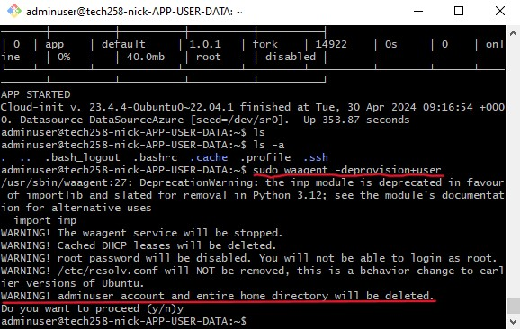

# Azure deployment via User Data

As devops engineers we want to automate all we can, and where possible. Once we manually execute the process, and we are confident it works, we then use scripts.

The next step is to deploy our app without having to manually input our ssh keys. 

We do this via Azure User Data. When setting up our vms, it can be found under the advanced tab. As in previous deployments remember to set up your database instance first, and have security set to basic and not trusted machines only.


* Then navigate to the advanced tab.


* Next scroll down to user data, we tick the box and a larger box where we can paste our script appears.


The User data runs all commands in our script as sudo if we specify it or not.

Complete set up as usual making sure to double-check, the correct security, AMI, network security group, virtual network, subnets and tags are being used. 

### User Data file path

When running/starting the app via user data we have to be aware of the file path it takes and the permissions needed to access the files for our app. Ideally we want to use a ```cd``` path the works no matter where we run the script from.
* * since we use ```gitclone``` in the script, with space repo after the url, it creates a folder called url and stores the app there. There are various ways to give us access to our app using recursively ```chmod -r``` for the app folder and everything inside permissions. ```chown -r``` to change owner of the folder and everything inside. Or using  ```sudo -E``` command.
*  We will use be using ```cd repo/app```. As no matter where we are, or which user, root or home we can ```cd``` into it.


User data runs only once, so make sure the script is thoroughly tested and works well.

### Script run-time 


You have to give the script time to run, the script commands are not executed any faster. In theory, you don't have to ssh in. With our app instance we can just check the public IP to see if it is running.

However, with the database instance there is no way to check the database is running but to ssh in. 
* * ### Instance checking
You can then check the log with ```nano /var/log/cloud-init-output.log``` to see what has been executed in nano. or ```cat /var/log/cloud-init-output.log``` to have it print to the terminal (this is the better command).

While the script is running you may get an agent not ready issue. This is just means the instance is not ready to be ssh'd into just yet. Either refresh, or click out to e.g connect and back to your instance overview incase it is a UI bug.

With your app instance you can check it runs via pasting the public IP, but again you'd first check your database. 

### Setting up an AMI image

#### First step

We ssh into our running virtual machine. To create a generalised image we use the command ```sudo waagent -deprovision+user```. This command is used to prepare a virtual machine for cloning. It retains the user data, but removes system-specific information, such as the SSH host keys and unique machine IDs.



* Next we go back to the overview page of our virtual machine, and press capture.


* To gain a snapshot of the machine in its current state the virtual machine will be stopped.

* We want to capture a managed image and not add it to gallery


* Follow a good naming convention. Giving the system used, what the instance is hosting e.g. app, image, and add vm at the end, so you know it is the vm. 


* The virtual machine will be stopped, so it can be captured.


* Shortly it will be complete.


* Then soon the AMI is ready to be used. Give it a few moments.


### Using created AMI

We can now use the created AMI to launch our instance. This allows our two-tier app to be launched quicker as: 
* we don't need to ssh in
* our app is already installed on the machine. We just need a little user data, so we can set our IP address in the environment variable and use pm2 to manage our app.

* * #### Selecting the AMI

We configure our vm as usual but instead of using a standard image we use our own.

* Go to see all images. 


* Then on the left panel, my images. We can use the search bar to filter for our image.


* Then at the bottom in the basics tab, for licensing we choose other.


* We then set the little user data we need to run the app. Don't change your working script. 
* * Only add what the AMI needs. Make these alterations where you are comfortable and copy and paste into the box. DO NOT make changes inside the User Data box.


#### * AMI User Data Script

```
#!/bin/bash

echo going to app folder...
cd repo/app
echo INSIDE APP FOLDER

echo setting env var DB_HOST
export DB_HOST=mongodb://10.0.3.4:27017/posts
echo DB_HOST ENV VAR SET

npm install

sudo pm2 stop all
pm2 start app.js
```
* We then continue as normal, making sure the right configurations are in place. We check our app instance public IP after giving it some time, and we've used our AMI to run our app.

### Consider

* You have to be completely be confident in your script, harder to fix once you've run the user data.
* File paths will be different as it starts from root user. Make sure it can be cd path into (app folder can be in root) 
* * Create a script that runs when you ssh in or user data. App folder can be in different location but has to be able to cd into
* Double check everything, have the correct: AMI, subnets, ssh keys, network security groups selected. Things will not run correctly if they aren't configured properly.

## Azure clean up

when terminating an instance you need to manually tick and remove, IP, Disk, and NIC as our instance materials aren't deleted on termination.

But DO NOT rely on this. Make sure to manually check and delete them. 