# Monitoring and alert management

### CPU Overload

If we have a vm hosting our app, and the cpu load becomes too high, it is extremely likely that vm hosting our app will go down if no one is watching it. See the diagram below explaining the worst to best in monitoring and responding to cpu load/traffic.

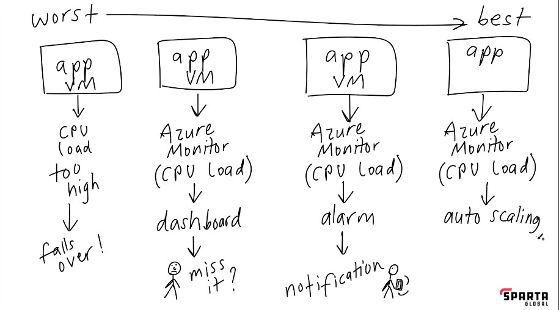

* If there is no monitoring our vm will go down. 

<b>

* We can set up a dashboard so that we can see when the load gets too high, but that requires someone to be watching it. Meaning the CPU overload can be missed, and the same problem persists. 


* The next best option is to set up an alarm so that when a threshold we set is reached, we will receive a notification, even to our phones.


* * However, this like the other options before, requires human intervention to come and fix. We need something better, and automatic.


* The automatic response is auto-scaling. It is an automatic response. Similar to when a fire alarm goes off and the sprinkler system also goes off and releases water. When the threshold we set is reached it auto-scales out more vms.

### Auto scaling 

Auto-scaling can be done out or in, and up or down.
* Out or in, refers to the addition or reduction of virtual machines as needed to meet demands.
* Up or down, refers to the switching of work load from one virtual machine to another with a bigger or smaller CPU depending on the demand.

### Creating a dashboard 

We create a dashboard, so we can have a visual check on our resources, allowing us to monitor them easier. We are also able to choose the charts we want to see.

By default, Azure and AWS monitor our instances, but it is basic.

* In our instance overview, we scroll down a little, so we can see the tabs and click the monitoring tab.

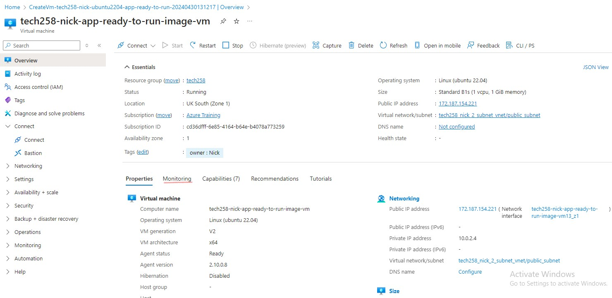

* We will be shown a few charts that gives us information on our instances in charts, and we can show more metrics.
* From here we choose a chart, press the pin icon to pin the dashboard, create new and follow good naming conventions.

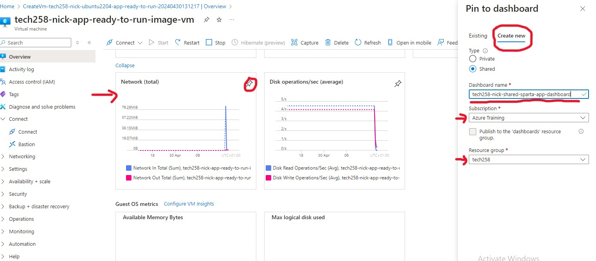

* We can add more charts by pinning them to the existing dashboard. (create new is underlined accidentally)

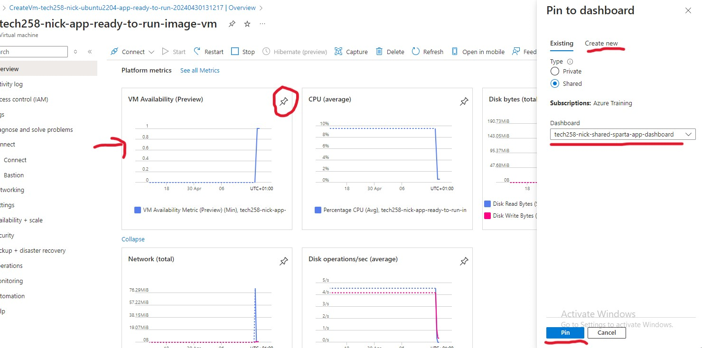

* We can use the searchbar or press the notification bell icon to navigate to our dashboard. Once there we can edit the size of the charts

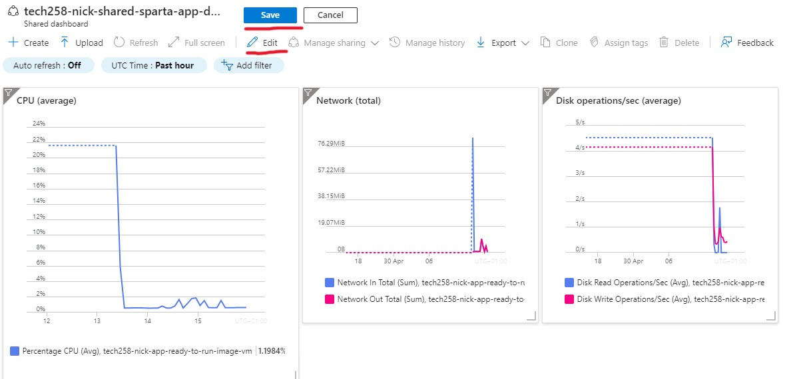

* and the intervals by clicking on the chart, and changing it on the top right. Remember to save to dashboard after making edits.

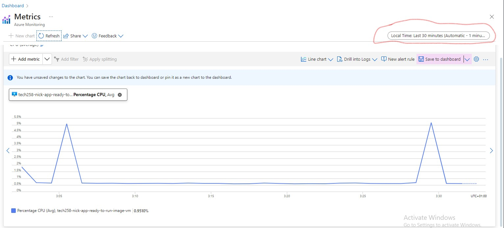

### Setting up an alert and action group

While in the metric/chart, we can set an alert for it by pressing alerts in the top bar.

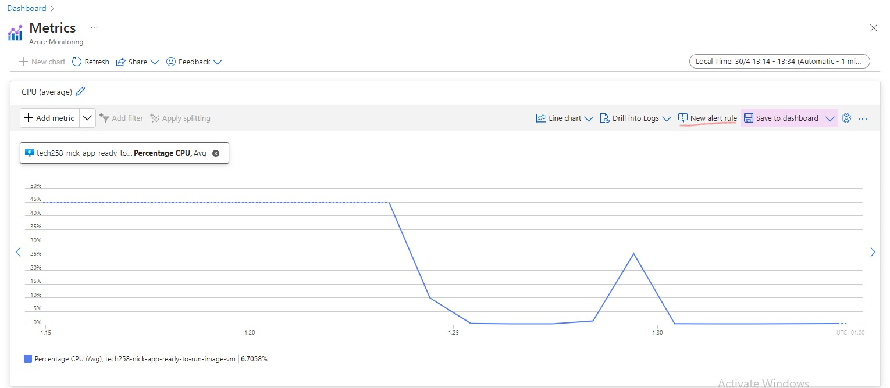

We then set the conditions for our alert. The metric is CPU usage, aggregate maximum (so the threshold can be hit once and not a average) and percentage set to 3%.
* * It is only this low as our app only posts a page and so its difficult to take up much CPU. Usually for an app the has logic and does things it will be around 75%.

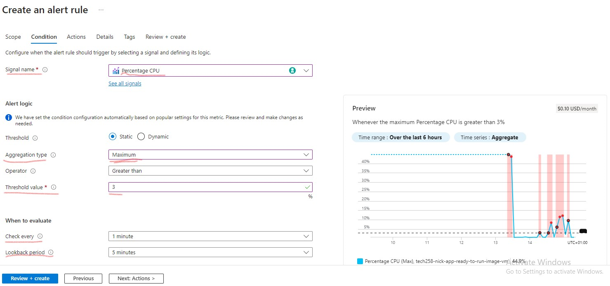

Next we set an action, which creates an action group. 

This specifies the action to take when our alert condition is met. In this case, send an email.

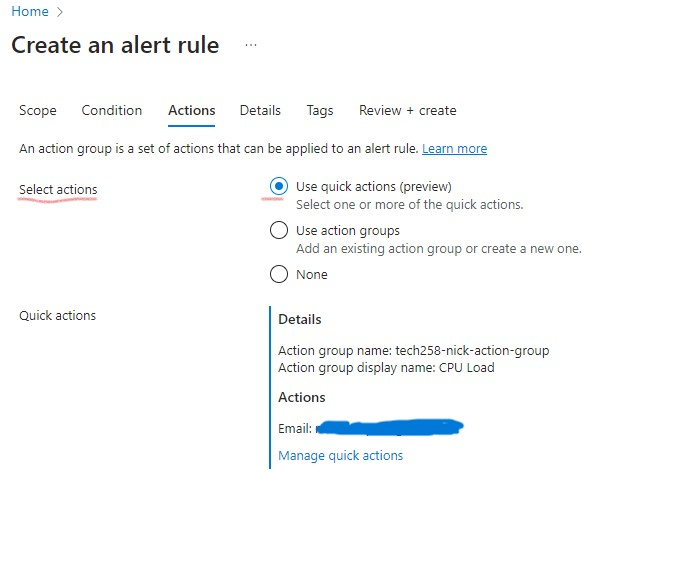

We then add some further details to the alert rule. Giving it a name, severity rating and a message if we choose.

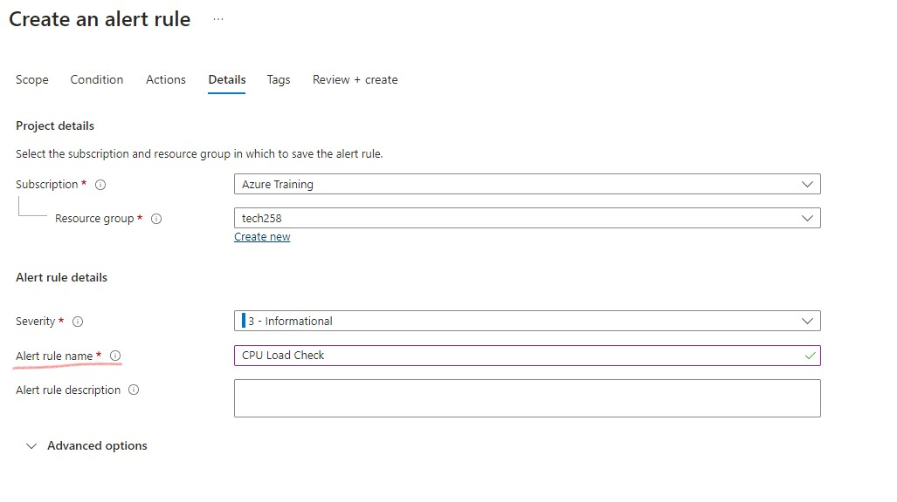

Next, as always we tag our resource. Then create it. We should get the notification it is created.

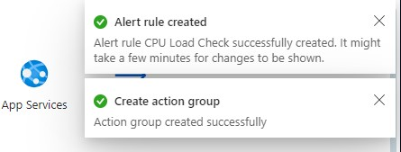

### Load testing the vm/app

 We can test our app CPU by using Apache bench to send requests to it, increasing traffic and spiking the CPU, so we get an alert.

* First we ssh in, then run the command to get Apache

```sudo apt-get install apache2-utils```

Once install is complete we can run the command  ```ab``` to check Apache bench is usable. 

We then use the command ```ab -n 1000 -c 100 http://172.187.154.221/``` to send a number of requests (-n 1000) at a set speed (-c 100 ) to a given IP address (Our app)

### The alert

Once the CPU threshold is hit we will get an alert via email. It is not immediate. 

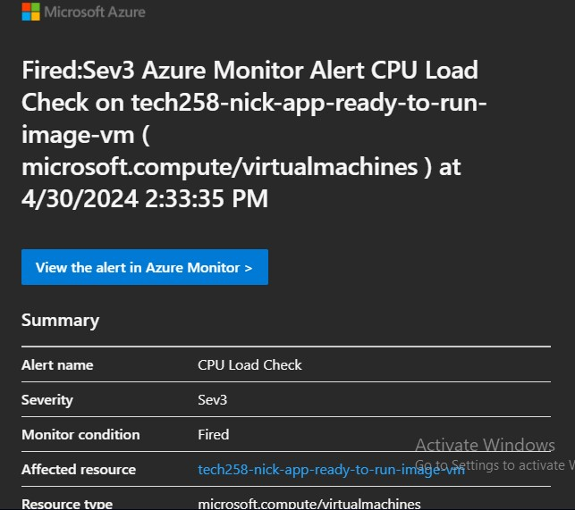