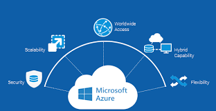
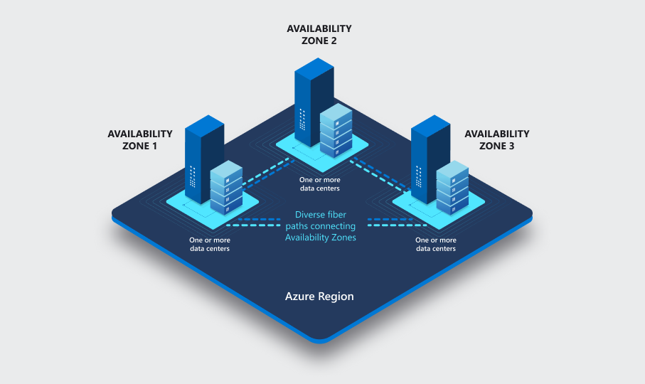

# Azure basics

### What is Azure?

Azure is Microsoft's cloud computing platform. It  offers a variety of services for individuals and organizations build, deploy, and manage applications and services through Microsoft's global network of data centers. 

### Main Azure services 

* *Compute:* Virtual Machines, Kubernetes Service, Azure Functions
* *Storage:* Blob storage, File storage, Table storage
* *Networking:* Virtual Network, Load Balancer, VPN Gateway
* *Databases:* SQL Database, Cosmos DB, MySQL, PostgreSQL
* *Identity* and Access Management: Azure Active Directory
* *AI and Machine Learning:* Azure Machine Learning, Cognitive Services
* *Internet of Things:* IoT Hub, IoT Central
*Developer Tools:* Azure DevOps, Visual Studio Team Services
*Management and Monitoring:* Azure Monitor, Security Center

### Azure Regions and Availability Zones

*Azure Regions:* Azure is organized into regions, which are geographic locations around the world where Microsoft has data centers. Each region is made up of one or more data centers that are in close proximity to each other and connected by high-speed networks. Azure regions are designed to provide low-latency access to Azure services for users and applications in that geographic area.

*Availability Zones:* Availability Zones are physically separate data centers within an Azure region. They are designed to provide high availability and fault tolerance by ensuring that applications deployed across multiple Availability Zones remain operational even if one zone fails. Each Availability Zone is equipped with independent power, cooling, and networking infrastructure to minimize the risk of service interruptions.

### Azure Structure/Organization

Azure is structured into various components:

*Subscriptions:* A subscription is a billing and management container for Azure resources. It defines the billing and resource access scope for Azure services.
*Resource Groups:* Resource groups are logical containers that hold related Azure resources for an application. They help you manage and organize resources in a more cohesive manner.
*Resources:* These are individual services or components you deploy within Azure, such as virtual machines, databases, storage accounts, etc.

### Ways to Access Azure
You can access Azure through various means:

*Azure Portal:* A web-based management console for interacting with Azure resources.
*Azure CLI:* Command-line interface for managing Azure resources.
*Azure PowerShell:* PowerShell cmdlets for managing Azure resources.
*Azure SDKs:* Software development kits for various programming languages.
*REST API:* Azure provides a comprehensive set of REST APIs for programmatic access.

### Azure vs Azure DevOps

*Azure:* Azure is a cloud computing platform that provides a wide range of cloud services, including computing, storage, networking, databases, AI, and more.
*Azure DevOps:* Azure DevOps is a set of cloud-based collaboration tools for software development, including version control (Azure Repos), build and release management (Azure Pipelines), project management (Azure Boards), and testing (Azure Test Plans).

### Azure Pricing Calculator

The Azure Pricing Calculator helps you estimate the cost of using Azure services based on your specific requirements. It allows you to select the services you plan to use, configure their settings, and estimate the monthly or yearly cost. This helps you plan and budget for your Azure deployments more effectively, avoiding unexpected expenses.