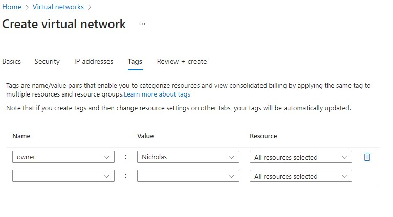

# Two tier app deployment on Azure

### Azure navigation

Go to portal.azure.com. At first glance the AWS interface is much simpler and easier on the eye.

### Generate ssh keys

Go to ssh repo for instructions on creating ssh keys

After logging in use services or search bar to get to ssh key. We can give Azure the public key, generated on our local machine. We can let Azure generate the keys for us and give us the .pem file(private key) but this time we won't.


* press create ssh key


* With Azure there are scope levels, which is a hierarchy of permissions in a sense (refer to Azure basics readme). We need to choose the created subscription (payment plan) and resource group (allocated resource permissions) we want to use.
*  * We then name the key pair (best practice to give same name given on local machine), and choose where we would like the public key to be given from. 
* Here we paste it in the box given, after we use the ```cat``` command on the public key file in our local machine, making sure it has no extra spaces before or after, and the file ends in .pub.


* We then set a tag. It is best practice on Azure to set tags for everything you create, so resources can be tracked and makes following billing easier.


* Next is reviewing and creating the keys (similar to summary on AWS). Azure verifies before creating your resources and will flag any errors, which AWS doesn't do for you, you have to make sure all is correct yourself.

* * here you see the red cross meaning an error was made. When it is a green tick you can proceed.


### Create Virtual Network

In Azure we must create a virtual network to have our instances hosted under. We do this by creating subnets, and assigning our instances to the subnet. We will create a public subnet(for app), and a private subnet(for database)

* * After this is done we are able to assign instances to the virtual network next time we wish to create them


#### Navigate to Virtual network 


#### Create Virtual network

Here you set the subscription and resource group as usual, and also the virtual network name and region.


* #### Create public subnet

We leave the security as standard, and move on to the IP addresses tab where we can create our subnets.

We first press add a subnet, the window appears to the right, and we can configure it. This will be where we host our app instance.


* #### Create private subnet

We repeat this process, but now pay attention to ticking the private subnet box at the bottom to make sure the subnet is private.


* #### Tag the virtual network



* #### Review the virtual network


### Create virtual machines

Now we move on to creating our virtual machines. As always we create the instance for the database first. SSH in, run our script and make sure the database is up and running before we begin with the app instance. 

The process is similar to AWS but has extra steps.

* #### Navigate to virtual machines 

You can go to the search bar where you can search, or the dropdown will show recent services you searched or popular services.


* #### Create VM/instance to host database

* * Again we set subscription and resource group. 
* * We then set details for or virtual machine, paying attention to proper naming and region choice, similar to AWS. 
* * We can leave availability as default. We are testing and don't have users, so it is not extremely important. If we did we'd choose a region and AZ close to the users to reduce latency.


* scrolling down we can pick our AMI imagine similar to AWS. We'll be using Ubuntu 22.0.4. And pick our instance type (like AWS), setting the size as standard B1s.


* further on the basics tab we set our username and the ssh key we want to use. We use the keys we created.


* the last part of the basics tab is setting the inbound port rules. Similar to AWS it is just SSH for our database, so we can ssh into the instance.


* we then move onto the disks tab which is where we set our storage (AWS equivalent). Make sure to choose standard SSD and delete with vm is ticked, as we don't need our storage to persist.


* Networking is the tab where we assign the virtual network and subnets we created. As it's the database instance we are creating make sure to assign it to the private subnet, and SSH inbound port is selected.


* Tag tab is next, we can leave the ones before as default. 


* finally we review and create. Note the green tick.


* next we navigate to *connect* to our instance. This will be on the left pane, when we have clicked the link to see our instance.


* then we go to get the commands we need to ssh in via our git bash.


* like in AWS we use the ```chmod``` command to protect our private key first, then the ```ssh -i``` command to use our private key to connect to the instance.


* we accept fingerprint with yes, and then we are in our instance. Follow the circled commands to first enter nano to paste our mongodb script (check mongodb readme) being aware of proper spacing, then give the script execute permissions, then run the script.


* When the script runs and our database is available, we can then follow the above steps of creating our virtual machine to host our app. 
* * make sure to assign the app instance to the public subnet, and properly set the security groups under the networking tab at the bottom once the instance is created and we can see its details. 
* * * Do this step before connecting to the instance.

### Create virtual machine to host app

The steps to create the vm to host our app are largely the same, accept we assign it to the public subnet: 


* * and we set the security groups when the instance is made. (In AWS we can set these while still setting up our instance, and can still make the additions after)


* * we then set the rules. 


* Note in Azure, you do not need to declare or open port 27017 for MongoDB. Azure Cosmos DB's API for MongoDB is a fully managed service that abstracts the underlying infrastructure and networking details from you.

#### Follow the above the same steps to ssh in to your instance as above, and run your app script. MAKE SURE TO CHANGE THE DB_HOST environment variable IP TO THE PRIVATE IP OF YOUR DATABASE INSTANCE. 

* Paste the public IP of your app instance in your browser remembering to add /posts at the end, and you should see your working app.