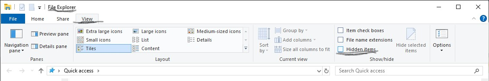

# Setting up an SSH key

### First things first

The first step sounds basic, but it is highly important. It is checking you have an .ssh folder. It is the only place you should store your highly important ssh keys and is a hidden folder.

In the correct folder in file explorer, click the view tab and click hidden items.



In git bash, to check you must check your current directory with ````pwd````. If you are in the user directory it should give you an output that looks like this ````/c/users/Jack````. Then use the command ````ls -a```` to print all folders including the hidden ones to your terminal. If it is not there create it with the command ````mkdir .ssh````. Go to the directory with ````cd .ssh```` then again use ````pwd```` to make sure the .ssh folder exists, and you are currently in it.

### Creating your SSH keys

Now that we are sure we are in the only folder we should be in when creating ssh keys, it's time to create your public and private keys. Using the command ````ssh-keygen -t rsa -b 4096 -C "input your email"````. Leave passphrase empty and name your keys. you should get a key fingerprint and a random art image. Print ````ls```` while in your .ssh folder to make sure your keys are inside.

Use the command ````cat (name of your public key)```` to receieve your public key.

### Linking to GitHub repo

Navigate to the Github repo you want to link. Go to the settings, scroll down to security and public key and fill in the information and paste the public key. *MAKE SURE YOU HAVE NOT COPIED ANY WHITESPACES*. Then press create key. You will be asked to sign in, do so and the key will be created. 

Navigate back to your repo and click *<> code* then SSH, and copy the link. Return to you Gitbash terminal, make sure you are in the correct directory, and use the command ```` git clone (paste SSH link) ````. Press enter. You will receive a message about the authenticity of host github.com cannot be established, and a fingerprint key will be shown with the message. It will ask if you want to continue, type y or yes

# Authorising terminal to use the SSH key

The connection will be made after the previous step but the rights to the repo will not be established. The Gitbash terminal you are using can be given access to use SSH keys with the command ````eval `ssh agent` ```` . (This is a process that gives access only to the terminal you are in) A Agent id will be returned.  

Use the command ````ssh-add```` and the file path name to the ssh key ````ssh-add ~/.ssh/github_test_key````. This gives the terminal the ability to use this key. The identity will be added, printing the file path and email given. 

# Last steps 

You can check the SSH connection to Github with the command ````ssh -T git@github.com````. You can now use the ````git clone```` command and pasting the SSH link from your repo. It will run, and when complete use ````ls```` and you will see your repo.