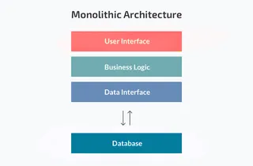
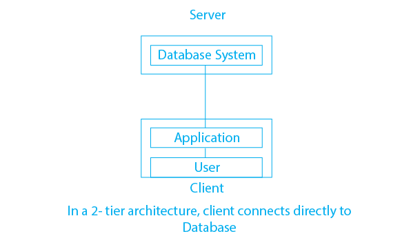

# Two Tier architectures vs Monolithic architectures

### What is a Monolithic architecture?

A monolithic architecture is a traditional software program model, built as a unified unit which is self-contained and independent of other applications. The app and all its dependencies are hosted on one server (machine), this also includes the business logic, user interface and database. 

### What is a Two Tier architecture?

A two tier architecture is a software architecture in which the application is run from two separate machines that are able to communicate with each other. The machine which hosts application (user interface etc.) is on one system, and the database is on hosted on a separate system. The app system then communicates to the database system for them to work together.

### Advantages and disadvantages

#### The advantages of a monolithic architecture are:
* *Simplicity:* Easier to develop, test, and deploy since everything is in one place.
* *Performance:* Can be faster due to less overhead in communication between components.
* *Deployment:* Deploying is simpler and faster as it's just one package.
* *Debugging and Testing:* Easier since all components are in one codebase.
* *Scaling:* Can scale to a certain extent by deploying more instances of the whole application.
* *Operational* Overhead: Requires fewer resources to manage and monitor compared to microservices.

#### The disadvantages of a monolithic architecture are: 

* *Limited Scalability:* It is hard to scale parts of the application independently.
* *Technological Heterogeneity:* You are stuck with one technology stack, making it hard to adopt new tech.
* *Development Bottlenecks:* Large teams working on different parts can slow development.
* *Limited Flexibility:* It is hard to make changes quickly without affecting everything.
* *Longer Deployment Cycles:* It takes longer to deploy changes due to the entire app being redeployed.
* *Low Fault Tolerance:* If one part of the app fails, the whole app can go down.
* *Scaling Challenges:* It is hard to scale specific parts of the app, often requires scaling the entire app.
* *Maintenance Complexity:* The large and complex codebase makes maintenance and enhancements difficult.

#### The advantages of a two tier architecture are:

* *Simplicity:* Easier to design, develop, and maintain.
* *Performance:* Faster response times due to reduced communication layers.
* *Scalability:* Components can scale independently, allowing for easier expansion.
* *Deployment:* Updates are straightforward with only two main components.
* *Resource Utilization:* Resources are distributed efficiently between client and server.
* *Separation of Concerns:* Clear division between client and server responsibilities.
* *Flexibility:* It allows for customization with technology choices for both client and server.
* *Security:* Easier to secure as a result of the server-side logic being centralised (separated).

#### The disadvantages of a two tier architecture are:

* *Limited Scalability:* It can struggle with handling large-scale deployments or sudden traffic spikes.
* *Limited Flexibility:* It may have difficulty accommodating changes or adding new features.
* *Performance Bottlenecks:* The server can become slow as the application grows, impacting performance.
* *Security Risks:* The client-side logic increases the risk of security vulnerabilities.
*Maintenance Difficulty:* Maintaining consistency and managing updates across both tiers can be challenging.
* *Limited Fault Tolerance:* A failure in either the client or server can affect the whole application.
* *Data Transfer Overhead:* There is increased network traffic and latency due to data transfer between client and server.
* *State Management Complexity:* Managing stateful interactions between client and server can be complex. 

(Stateful meaning the system recalls past conversations and interactions or knows the current stage in the interaction. This assists the system in providing personalised responses or recalling where it left off in a process)

### Conclusion

Choosing between a monolithic and two-tier architecture depends on various factors such as the size and complexity of the application, scalability requirements, team expertise, and resource constraints. In general, you'd use:

* A Monolithic Architecture for smaller, less complex applications with simpler deployment and maintenance needs.
* And Two-Tier Architecture when there's a clear separation between client-side and server-side responsibilities, scalability requirements are diverse, or performance optimization is crucial.

