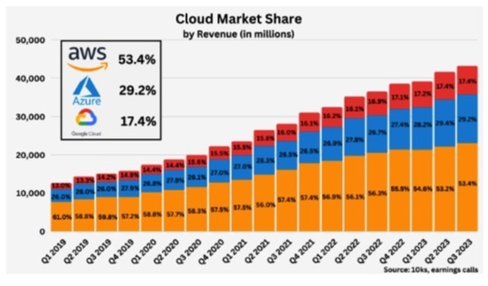

# Cloud computing and the Cloud

### What is cloud computing?

Cloud computing is using the internet to borrow or rent computing resources over the internet from those who have large amounts. This makes it so you don't have to have these resources you can use theirs. 

### How do we know if it's in the cloud? 

If it is not on your/the users physical servers (on prem), but stored or processed on a cloud service providers servers such as Google or Amazon, then we know it is on the cloud. 

The main difference is that you manage and maintain the serves yourself with on-prem (costs included), whilst with the cloud all of this is taken care of for you. 

### The 4 deployment models of cloud 

* Private cloud: Infrastructure is dedicated to a single organization, either on-premises or hosted by a third-party provider.
* Public cloud: Services are offered over the public internet and are available to anyone who wants to use them.
* Hybrid cloud: A mix of private and public clouds, allowing data and applications to be shared between them.
* Multi-cloud: Using services from multiple cloud providers to avoid vendor lock-in and take advantage of the best features from each.

### The types of cloud services

* IaaS (Infrastructure as a Service): Provides virtualized computing resources over the internet, such as virtual machines, storage, and networking.<b>
* PaaS (Platform as a Service): Offers a platform allowing customers to develop, run, and manage applications without worrying about the underlying infrastructure.<b>
* SaaS (Software as a Service): Delivers software applications over the internet on a subscription basis, eliminating the need for installation and maintenance.

### Advantages and disadvantages of the cloud

* Advantages: Scalability, flexibility, cost-effectiveness, reliability, and accessibility.<b>
* Disadvantages: Security concerns, dependency on internet connectivity, potential downtime, and data privacy issues.

### Difference between OpEx and CapEx.

* *OpEx (Operational Expenditure):* Ongoing expenses for running a business (e.g., utility bills, salaries).
* *CapEx (Capital Expenditure):* Upfront expenses for assets that provide long-term benefit (e.g., buying servers).

##### How do OpEx and CapEx relate to the cloud?

Cloud services are typically OpEx because you pay for what you use, rather than making large upfront investments in computing infrastructure and hardware.

# Is migrating to the cloud always cheaper?

In short no. But this is also dependent on a few factors. As while cloud services offer potential cost savings due to their pay-as-you-go model and scalability, factors like existing infrastructure, data transfer costs, and ongoing management can affect the overall cost.

# Market share breakdown

This image shows the AWS for a long time as lead the competition in terms of market share in the cloud.

# The three largest cloud providers and their USPs

* *Amazon Web Services (AWS):* Known for its vast array of services, global infrastructure, and strong developer ecosystem.
* *Microsoft Azure:* Strong integration with Microsoft products, hybrid cloud solutions, and comprehensive enterprise services.
* *Google Cloud Platform (GCP):* Emphasizes data analytics, machine learning, and innovation, leveraging Google's expertise in these areas.

# Which cloud provider might be the best and why?

This question is heavily dependent on use case. But because of the sheer variety and amount of services, it might be AWS. You'd be hard pressed to find a need that isn't met by a service AWS provides.

# What do you usually need to pay for when using the cloud?

More often you'll be paying for computing resources (e.g., virtual machines), storage, data transfer, and additional services used, such as databases, analytics, and machine learning.

# The four-pillars of DevOps and how they relate to cloud

The four pillars of DevOps are *Culture*, *Automation*, *Measurement*, and *Sharing* (CAMS). 

The cloud enables DevOps practices by providing scalable infrastructure, automation tools, metrics for monitoring and measuring performance, and collaboration platforms for sharing knowledge and code.
