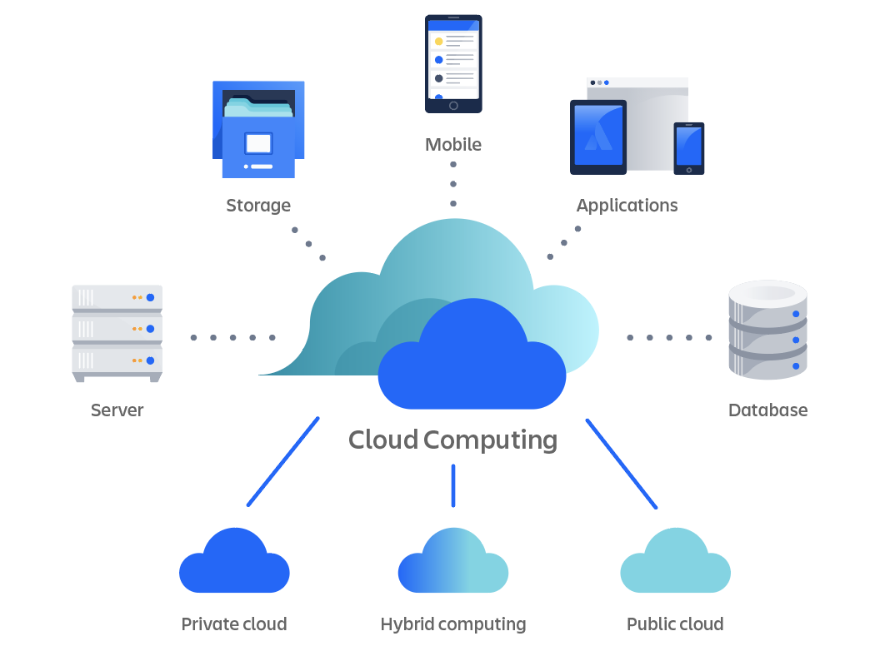

# Cloud computing and the Cloud

### What is cloud computing?

Cloud computing is using the internet to borrow or rent computing resources over the internet from those who have large amounts. This makes it so you don't have to have these resources you can use theirs. 

### How do we know if it's in the cloud? 

If it is not on your/the users physical servers (on prem), but stored or processed on a cloud service providers servers such as Google or Amazon, then we know it is on the cloud. 

The main difference is that you manage and maintain the serves yourself with on-prem (costs included), whilst with the cloud all of this is taken care of for you. 

### The 4 deployment models of cloud 

* Private cloud: Infrastructure is dedicated to a single organization, either on-premises or hosted by a third-party provider.
* Public cloud: Services are offered over the public internet and are available to anyone who wants to use them.
* Hybrid cloud: A mix of private and public clouds, allowing data and applications to be shared between them.
* Multi-cloud: Using services from multiple cloud providers to avoid vendor lock-in and take advantage of the best features from each.

### The types of cloud services

* IaaS (Infrastructure as a Service): Provides virtualized computing resources over the internet, such as virtual machines, storage, and networking.<b>
* PaaS (Platform as a Service): Offers a platform allowing customers to develop, run, and manage applications without worrying about the underlying infrastructure.<b>
* SaaS (Software as a Service): Delivers software applications over the internet on a subscription basis, eliminating the need for installation and maintenance.

### Advantages and disadvantages of the cloud

* Advantages: Scalability, flexibility, cost-effectiveness, reliability, and accessibility.<b>
* Disadvantages: Security concerns, dependency on internet connectivity, potential downtime, and data privacy issues.

